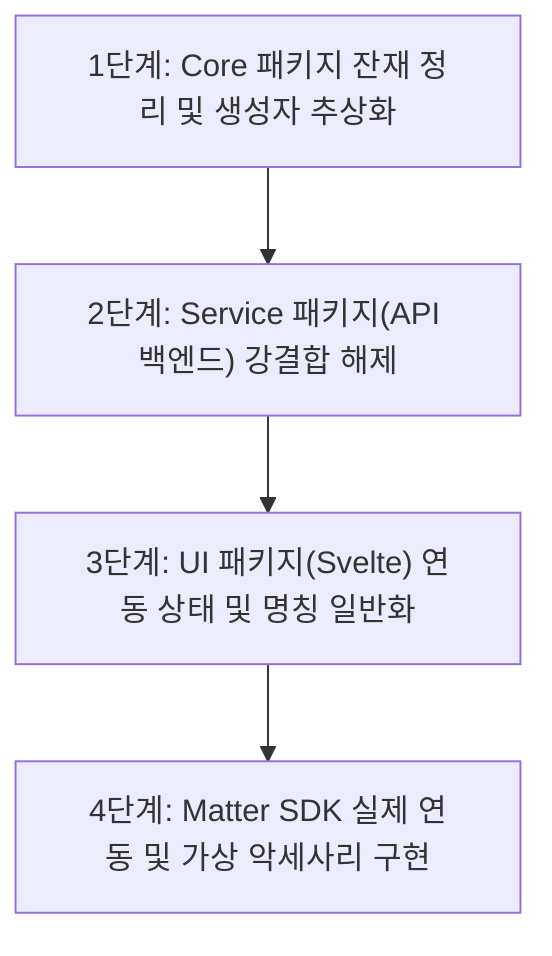

# Matter 완전 전환 및 MQTT 독립화 상세 로드맵

이 문서는 HomeNet Bridge 프로젝트가 MQTT 의존성에서 완전히 탈피하고, 향후 스마트홈 표준 프로토콜인 **Matter로 완전히 전환**하기 위해 필요한 구체적인 엔지니어링 작업과 파일별 세부 수정 가이드를 담고 있습니다.

---

## 📅 로드맵 개요

연동 인터페이스의 완벽한 분리와 실질적인 Matter 동작을 보장하기 위해 다음과 같이 4단계로 나누어 진행합니다.

---

## 🛠️ 단계별 상세 작업 명세

### 1단계: Core 패키지 잔재 정리 및 생성자 추상화
Core 레벨에 남아 있는 MQTT 관련 하드코딩과 레거시 코드를 제거하여 진정한 멀티 프로토콜 지원 기틀을 완성합니다.

*   **1.1 불필요한 MQTT 임포트 제거**
    *   [bridge.service.ts](file:///home/woooook/homenet2mqtt-1/packages/core/src/service/bridge.service.ts) 상단에서 실제로 호출되지 않는 `import mqtt from 'mqtt';` 및 `MqttSubscriber`, `MqttPublisher`, `DiscoveryManager`를 제거합니다.
*   **1.2 생성자 파라미터(`BridgeOptions`) 추상화**
    *   현재 `mqttUrl`, `mqttUsername`, `mqttPassword` 등이 톱레벨 옵션으로 지정되어 있습니다. 이를 제거하거나 통합 옵션 `integration` 구조 아래로 이동시킵니다.
    *   설정 파일(`.yaml`)이 없는 테스트 환경 등의 하위 호환성을 위해, 백업용 헬퍼 함수를 구축하여 구동 시 적절한 `IntegrationConnector`를 주입하도록 구성합니다.
*   **1.3 StateManager의 MQTT 연동 탈피**
    *   [state-manager.ts](file:///home/woooook/homenet2mqtt-1/packages/core/src/state/state-manager.ts) 생성자의 `mqttPublisherOrTopicPrefix` 처리를 인터페이스 기반으로 정비하고, MQTT만을 위한 특수 분기들을 코어 내부에서 커넥터 측 콜백으로 위임합니다.

---

### 2단계: Service 패키지(API 백엔드) 강결합 해제
Express 기반 서비스 구동 엔진이 MQTT의 유무와 상관없이 동작할 수 있도록 가상화 및 에러 핸들러를 개편합니다.

*   **2.1 환경 변수 의존도 분리**
    *   [server.ts](file:///home/woooook/homenet2mqtt-1/packages/service/src/server.ts) 내부에서 `process.env.MQTT_URL`이 누락되거나 연결되지 않더라도 서비스 부트스트랩(`instantiateBridges`)이 실패하지 않도록 수정합니다.
    *   설정 파일에 `integration: type: matter` 또는 `type: log`가 지정되어 있다면, MQTT 관련 셋업 및 환경변수 검증 과정을 건너뛰도록 분기 처리를 구현합니다.
*   **2.2 EventBus 이벤트 일반화**
    *   `mqtt:status`, `mqtt:error`, `mqtt:disconnected` 등으로 한정된 서비스 이벤트를 `integration:status`, `integration:error` 등의 일반 연동 이벤트로 리팩토링합니다.
    *   [bridge-errors.ts](file:///home/woooook/homenet2mqtt-1/packages/service/src/utils/bridge-errors.ts) 내의 MQTT 전용 에러 코드(`MQTT_CONNECT_FAILED` 등)를 연동 에러(`INTEGRATION_CONNECT_FAILED`)로 일반화하여 가공하도록 구성합니다.
*   **2.3 DiscoveryManager 수동 참조 제거**
    *   라우터 단([config.routes.ts](file:///home/woooook/homenet2mqtt-1/packages/service/src/routes/config.routes.ts))에서 Core의 `DiscoveryManager`를 직접 가져오는 로직을 제거하고, `IntegrationConnector` 인프라 내부에서 자동 활성화되도록 구조를 캡슐화합니다.

---

### 3단계: UI 패키지(Svelte) 연동 상태 및 명칭 일반화
프론트엔드 UI 화면에서 특정 프로토콜(MQTT)을 암시하는 텍스트 및 로직을 제거하고, 연동 타입에 따라 컴포넌트가 동적으로 대응하도록 수정합니다.

*   **3.1 상태명 및 웹소켓 이벤트 추상화**
    *   [App.svelte](file:///home/woooook/homenet2mqtt-1/packages/ui/src/App.svelte) 내의 `mqttConnectionStatus` 변수를 `integrationStatus`로 변경합니다.
    *   웹소켓 통신 시 사용되는 메시지 타입 `mqtt-message` 등을 `integration-message` 혹은 `device-state-message`와 같이 범용 명칭으로 변경합니다.
*   **3.2 UI 렌더링 조건부 분기**
    *   현재 연동 설정이 `mqtt`인 경우에만 화면에 "MQTT 연결 상태"나 "MQTT 유지 메시지 초기화" 버튼이 나타나도록 구현합니다.
    *   만약 연동 설정이 `matter`라면, 화면에 "Matter 연결 상태" 및 온보딩용 "Passcode / QR Code 번호"가 노출되도록 컴포넌트를 설계합니다.
*   **3.3 i18n 번역 파일 수정**
    *   [ko.json](file:///home/woooook/homenet2mqtt-1/packages/ui/src/lib/i18n/locales/ko.json) 등에서 `mqtt_cleanup`과 같은 고정 명칭 대신, 연동 방식에 알맞은 라벨이 적용되도록 번역 키 구조를 개선합니다.

---

### 4단계: Matter SDK 실제 연동 및 가상 악세사리 구현
비어 있는 [matter.connector.ts](file:///home/woooook/homenet2mqtt-1/packages/core/src/transports/matter/matter.connector.ts) 스텁을 완성하여 실제 스마트홈 생태계와 Matter 규격으로 통신을 시작합니다.

*   **4.1 Matter 공식 SDK 의존성 추가**
    *   스마트홈 표준 Matter 스택 구동을 위해 `@project-chip/matter.js` (또는 최신 정식 패키지) 라이브러리를 종속성에 추가합니다. (추가 전 `scan_dependencies` 필수 실행)
*   **4.2 Matter Commissioning 인프라 구축**
    *   `MatterConnector` 구동 시, 지정된 포트(예: 5540) 및 Passcode/Discriminator를 기반으로 로컬 Matter Bridge 노드를 초기화하고 페어링 대기 상태를 시작합니다.
*   **4.3 기기 엔티티 매핑 구현**
    *   RS485 패킷 프로세서에서 감지된 홈넷 기기 타입(`light`, `switch`, `valve`, `thermostat` 등)을 Matter 표준 클러스터 및 엔드포인트(Device Type)로 변환 및 바인딩합니다.
    *   Matter 컨트롤러(Apple Home, Google Home 등)로부터 제어 명령(On/Off 등)이 유입되면, `executeCommand` 메서드를 트리거하여 RS485 시리얼 단으로 패킷이 발송되도록 파이프라인을 작성합니다.
