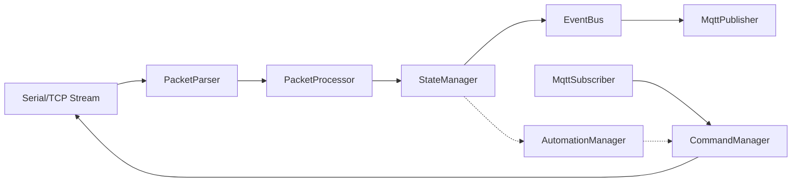

# @rs485-homenet/core

The core logic engine for the HomeNet2MQTT bridge. This package handles the heavy lifting of communicating with RS485/Serial devices, parsing their protocols, maintaining state, and bridging that state to MQTT.

It is designed to be framework-agnostic, capable of running within a Node.js service (as seen in `@rs485-homenet/service`) or potentially other environments.

## 🏗️ Architecture

The core package implements a unidirectional data flow for state updates and a command pattern for device control.



## 🧩 Key Components

### `HomeNetBridge`

The main entry point and orchestrator. It initializes all sub-systems (MQTT, Serial, Managers) based on the provided configuration.

### `PacketParser`

Responsible for converting a continuous stream of raw bytes into discrete, valid packets. It implements a robust sliding window buffer and supports multiple parsing strategies:

- **Header Enforcing**: Syncs stream by finding a specific header byte sequence.
- **Fixed Length**: Fast parsing for simple protocols.
- **Footer Delimited**: Scans for end-markers.
- **Checksum Sweep**: Brute-force scanning for valid packets in variable-length protocols (Strategy C).

### `PacketProcessor`

Translates raw binary packets into high-level Entity state updates (e.g., `[0x02, 0x01]` -> `Light turned ON`). It uses `GenericDevice` definitions and CEL (Common Expression Language) for flexible parsing.

### `StateManager`

Maintains the "Source of Truth" for all device states in memory. It handles:

- Deduplication of state changes.
- Emitting `state:changed` events.
- Optimistic updates for responsive UI.

### `CommandManager`

Manages the reliable delivery of commands to devices. It implements:

- Priority Queuing (High/Normal/Low).
- Automatic Retries.
- ACK verification (waiting for state change confirmation).

### `AutomationManager`

An internal rules engine that allows for local logic execution (e.g., "When Light A turns on, wait 500ms then turn on Fan B"). It supports complex conditions via CEL.

## 🛠️ Usage

This package is primarily consumed by `@rs485-homenet/service`.

```typescript
import { createBridge } from '@rs485-homenet/core';

const bridge = await createBridge(
  '/config/homenet.yaml', // Config path
  'mqtt://localhost:1883', // MQTT Broker
);

// The bridge is now running, listening to serial ports and MQTT.
```
